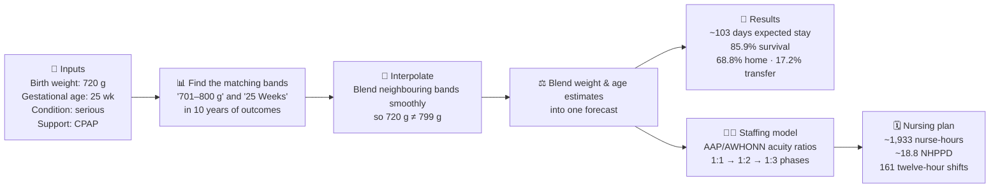
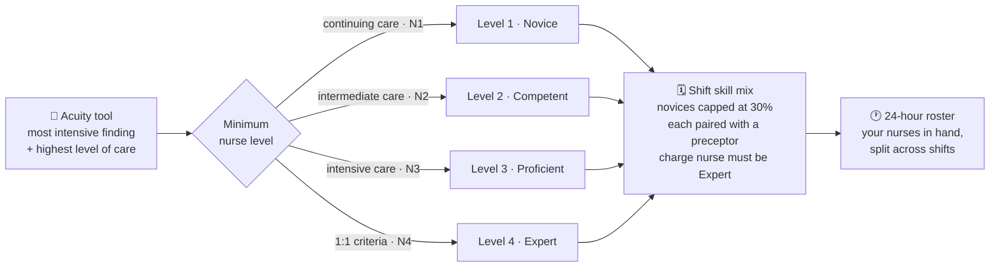
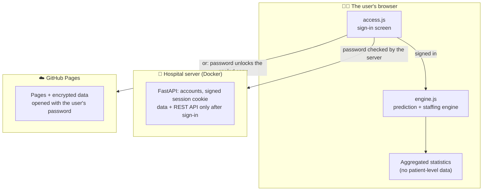

# 🩵 NeoStay — Infant NICU Outcome & Staffing Intelligence

**Live site (registered users only) → https://abdulrazakucc.github.io/patient-nurse-schedule/**
*(works on any phone, tablet or laptop — nothing to install)*

NeoStay is a web application that helps care teams answer three questions the
moment a very small baby is admitted to a Neonatal Intensive Care Unit (NICU):

1. **How long will this baby likely stay in hospital?**
2. **What are the chances the baby goes home healthy?**
3. **How many nurses will the baby — and the whole unit — need?**

It is built on a decade (2016–2026) of real, aggregated outcome statistics for
**Very Low Birth Weight (VLBW)** infants — babies born under about 1,500 grams.

> ⚠️ **Important:** NeoStay is a decision-support prototype for education and
> research discussion. It is **not** a medical device and must never replace
> clinical judgment.

## Project Leadership and Contributions

### Waseem Altaf, MD — Project and Clinical Lead

Provides clinical direction, neonatal-care expertise, research requirements,
interpretation, data stewardship, domain validation and hospital coordination.

### Abdul Razak, PhD — Technical Lead, Lead Developer and Applied AI/Data Science Lead

Leads the platform’s technical and analytical development, including system
architecture, prediction and staffing methods, scheduling algorithms, full-stack
implementation, interactive analytics, software testing, cross-engine validation,
technical documentation and deployment engineering.

Clinical conclusions remain under clinical leadership; the separate areas of
responsibility are set out in [CONTRIBUTORS.md](CONTRIBUTORS.md).

**Citing NeoStay:** if you use NeoStay in research, please cite it using the
metadata in [CITATION.cff](CITATION.cff).

---

## 🍼 For the non-medical reader — what is this about?

| Term | Plain-language meaning |
|------|------------------------|
| **NICU** | The hospital ward that cares for newborn babies who need intensive care |
| **VLBW** | *Very Low Birth Weight* — a baby born weighing less than ~1,500 g (3.3 lb) |
| **Gestational age (GA)** | How many weeks the pregnancy lasted before birth (full term ≈ 40 weeks) |
| **Length of stay (LOS)** | How many days the baby stays in hospital |
| **Disposition** | How the hospital stay ends: discharged **home**, **transferred** to another hospital, or **died** |
| **IQR** | The "realistic range" — the middle 50% of similar babies fall inside it |
| **Acuity** | How sick a patient is, and therefore how much nursing attention they need |
| **NHPPD** | *Nursing Hours Per Patient Day* — a standard measure of nursing workload |
| **Census** | The list of babies currently admitted to the unit |

The core idea is simple: **the smaller and more premature a baby is, the longer
the stay and the more nursing care is needed.** NeoStay quantifies exactly that,
from real historical outcomes.

---

## 🖥️ The six pages

| Page | What you do there | Who it helps |
|------|-------------------|--------------|
| **Home** | Overview, headline statistics, "unit at a glance" | Everyone |
| **Predict** | Enter one baby's weight, age & condition → get stay / survival / nursing forecast | Neonatologists, counsellors, families |
| **Scheduling** | Classify each baby on the acuity tool to build the census → get nurses needed per shift | Charge nurses, managers |
| **Acuity tool** | Read Dr. Altaf's nurse skills classifier: acuity tool and levels of care | Charge nurses, educators |
| **Timeline** | Watch care intensity change hour-by-hour across a simulated year | Educators, planners |
| **Analytics** | Interactive population charts across all weight bands & weeks | Researchers, QI teams |

---

## 🔮 How a prediction is made (visual)



Every number is **traceable to the underlying dataset**, and each forecast
displays how many similar infants stand behind it (the confidence signal):
≥50 babies → *high*, 20–49 → *moderate*, 5–19 → *low*.

## 👩‍⚕️ Nurse experience & competency

Staffing is not just *how many* nurses, but *who*. NeoStay grades nurses using
**Benner's novice-to-expert stages** (1984) — the framework behind most NICU
clinical-ladder programmes.

| Level | Stage | Experience | Typical assignment |
|:---:|---|---|---|
| **1** | Novice / Advanced Beginner | 0–1 year | Convalescent feeder-growers; intermediate care with a preceptor |
| **2** | Competent | 1–3 years | Intermediate / special care; stable intensive with support |
| **3** | Proficient | 3–5 years | Intensive 1:1, including ventilated infants; precepts novices |
| **4** | Expert | 5+ years | Most unstable infants; **charge nurse**; precepting |



On the Scheduling page, each infant is classified with **Dr. Waseem Altaf's nurse
skills classifier** ([datasets/nurse-skills/](datasets/nurse-skills/)), shown in
full on the Acuity tool page:

- the **most intensive finding** across body systems sets the nurse:patient
  ratio: 1:1 for the tool's footnoted criteria, otherwise 1:2 for intensive and
  intermediate care and 1:3 for continuing care (the protective end of each range);
- the **highest level-of-care criterion** met sets the care level, N1–N4;
- the minimum nurse level is the higher of the two: intensive L3 (1:1 L4),
  intermediate L2, continuing L1, and N1–N4 → L1–L4.

The build reads only the CSVs transcribed from the scanned PDF; the handwritten
annotations are ignored. The Predict and Timeline pages forecast a whole stay
rather than a shift, so they still use the modelled acuity below.

In that model, Level 4 is deliberately scarce — reserved for infants who are *both* critically
ill and ventilated. Proficient nurses routinely care for ventilated VLBW
infants, and a unit cannot roster an expert to a third of its cots; making every
sick infant expert-only would produce a requirement no real unit could meet.
About 19% of the simulated cohort needs an Expert, against an expert workforce
share of 26%.

## 🕐 Rostering the nurses you actually have

The Scheduling page takes the nurses **in hand** — a count per competency level
that you edit directly — and rosters them against the census:

- each nurse works **one shift per day**, so the pool is split across shifts;
- a nurse carries at most **one full assignment** (one 1:1 infant, or two 1:2
  infants, or three 1:3 infants);
- the sickest infants are placed first, into the **least senior qualified**
  nurse, keeping experts free for the infants who need them;
- one senior nurse is held back as **charge**, with no bedside load.

The result is a **24-hour roster chart**: one bar per nurse across a day that
starts at 07:00, split into hours committed to infants and spare capacity, and
coloured by competency level. Any infant no qualified nurse can take appears as
a red bar and is highlighted in the census table, with a banner naming exactly
how many extra nurses of which level would close the gap.

A nurse may always cover an assignment **below** their level, never above it, so
a shift's requirements accumulate downward from the expert tier. NeoStay also
reports an **effective care capacity** (experience-weighted), so a roster that
is numerically adequate but too junior shows up as a risk rather than passing
silently.

The Scheduling page plots this as three bars — *acuity demand*, *recommended
roster*, and *effective capacity* — each broken down by level. When the third
bar falls short of the first, the shift is staffed by headcount but not by
experience, and the app says so in plain language. The Predict page shows the
same idea per infant, as a competency band running along the top of the staffing
chart (Expert early in the stay, Novice by discharge).

> **Provenance.** The stages and year bands are the published Benner framework.
> The experience weightings, the 30% novice cap and the preceptor rule are
> transparent **modelling assumptions** for planning discussion — no validated
> nurse-scheduling dataset underlies them, and they are easy to change once real
> rostering data exists.

### The three phases of a NICU stay

```mermaid
gantt
    dateFormat X
    axisFormat %s
    section A typical VLBW stay
    Intensive — one nurse per baby         :crit, 0, 40
    Intermediate — one nurse per 2 babies  :active, 40, 75
    Convalescent — one nurse per 3 babies  :done, 75, 103
```



Sicker or smaller babies spend proportionally longer in the intensive phase —
that is what drives the nurse-staffing forecast.

---

## 🏗️ Architecture — sign-in first, private by design

The prediction engine runs **inside the user's web browser**, and nothing typed
into the tools is sent to a server. Every page starts with a sign-in screen:
the data and the engine load only after a registered user signs in.



- **On a hospital server**, FastAPI checks the password and serves the data and
  the API only to a signed-in session. See [docs/DEPLOYMENT.md](docs/DEPLOYMENT.md).
- **On GitHub Pages**, which cannot check passwords, the data is published
  encrypted; a registered account's password decrypts it in the browser.

Both use the same accounts file and the same sign-in screen. Details and limits
are in [SECURITY.md](SECURITY.md).

Two interchangeable engines, verified equal:

- **`frontend/engine.js`** — runs in the browser
- **`backend/app/predictor.py` + `nursing.py`** — Python/FastAPI, for API consumers

`tests/test_engine_parity.py` runs the browser engine and compares its acuity
classifications, unit schedules and rosters with the Python engine, value for value.

---

## 📂 Project structure

```
patient-nurse-schedule/
├── frontend/                  ← the web app
│   ├── index.html · predict.html · schedule.html · acuity.html
│   │   timeline.html · analytics.html · about.html
│   ├── access.js              ← sign-in gate: loads data + engine after sign-in
│   ├── access-config.js       ← "server" here; the Pages build writes "sealed"
│   ├── sealed.js              ← opens the encrypted GitHub Pages data
│   ├── engine.js              ← browser-side prediction & staffing engine
│   ├── components.js          ← shared nav / footer / icons / toasts
│   ├── styles.css             ← design system
│   ├── data/                  ← pre-built data bundles (served only after sign-in)
│   └── vendor/chart.umd.min.js
├── backend/app/               ← FastAPI server
│   ├── main.py · config.py    ← app, security headers, settings
│   ├── auth.py · accounts.py  ← sign-in, sessions, accounts command line
│   └── predictor.py · nursing.py · acuity_tool.py · data_loader.py · timeseries.py
├── datasets/
│   ├── losdata/               ← source aggregated CSVs (N / median / Q1 / Q3)
│   └── nurse-skills/          ← Dr. Altaf's classifier: scanned PDF + one CSV per page
├── generated_data/            ← simulated year of hourly unit activity
├── datagen/generate.py        ← regenerates the simulated data
├── scripts/
│   ├── build_frontend_data.py ← rebuilds frontend/data/ from the CSVs
│   ├── build_pages_site.py    ← builds the (sealed) GitHub Pages site
│   └── smoke_test.sh          ← checks a running server end to end
├── tests/                     ← sign-in, Pages build, page gating, engine parity
├── Dockerfile · docker-compose.yml · deploy/   ← hospital server (docs/DEPLOYMENT.md)
├── Makefile                   ← common commands: make run, make test, make user-add…
└── .github/workflows/         ← CI (tests + container) and GitHub Pages deploy
```

---

## 🚀 Run it

NeoStay is for **registered users only**: every way of running it starts with
the sign-in screen.

### On a hospital server

Follow **[docs/DEPLOYMENT.md](docs/DEPLOYMENT.md)** — one Docker container, HTTPS,
and accounts managed from the server's command line.

### On your computer

```bash
make user-add EMAIL=you@hospital.org NAME="Your Name"   # asks for a password (12+ characters)
make run                                                # open http://127.0.0.1:8000 and sign in
```

Without `make`: `cd backend && ../.venv/bin/python -m app.accounts add you@hospital.org`,
then `./run.sh`. Set `NEOSTAY_EXPOSE_DOCS=true` to see the interactive API docs at `/docs`.

### The GitHub Pages copy

**https://abdulrazakucc.github.io/patient-nurse-schedule/** — see *Deployment*
below for how accounts reach it. `make site-serve` previews the same build locally.

### Tests, and rebuilding the data bundles

```bash
make test        # sign-in, sealed Pages build, page gating, browser/Python engine parity
make data        # rebuild frontend/data/ after changing the CSVs
```

---

## 🔌 API (NeoStay server)

Every endpoint except `/api/health` and `/api/auth/*` requires a signed-in session.

| Method | Endpoint | Purpose |
|--------|----------|---------|
| GET | `/api/health` | Service status (public) |
| POST | `/api/auth/login` | Sign in `{email, password}`; sets the session cookie |
| POST | `/api/auth/logout` | Sign out |
| GET | `/api/auth/session` | Who is signed in (public) |
| GET | `/api/meta` | Centers + weight/GA bins |
| GET | `/api/analytics` | Aggregated distributions for charts |
| POST | `/api/predict` | Per-infant forecast `{weight_g, ga_weeks, condition, resp_support}` |
| GET | `/api/acuity-tool` | Dr. Altaf's classifier, with the finding ids `/api/schedule` accepts |
| POST | `/api/schedule` | Unit staffing from a census `{infants:[{..., findings}], shifts_per_day}` |
| GET | `/api/ts/*` | Hourly timeline aggregations |

---

## 🔒 Privacy & security

- **Registered users only.** Pages show a sign-in screen; the data, the engine and
  the API load only after sign-in.
- **Passwords are never stored readable.** Accounts hold PBKDF2-SHA256 hashes
  (600,000 iterations, per-account salt). The server issues a signed, expiring,
  `HttpOnly` session cookie, slows repeated failed sign-ins, and ends sessions
  at once when an account is removed or its password changes.
- **No patient-level data anywhere.** Only aggregated statistics (counts, medians,
  quartiles) and synthetic timeline data.
- **Calculations stay in the browser.** What you type into the tools is not sent
  to any server. There is no tracker or analytics.
- **Sign-in protects the website, not this repository.** While the repository is
  public, its datasets and data bundles can be read on GitHub by anyone.
- **Strict Content-Security-Policy** on every page. Chart.js is bundled locally;
  the only external requests are the Google Fonts stylesheets.

The full policy, including the limits of the GitHub Pages copy, is in
[SECURITY.md](SECURITY.md).

## ☁️ Deployment

**Hospital server:** see [docs/DEPLOYMENT.md](docs/DEPLOYMENT.md).

**GitHub Pages:** every push to `main` runs `.github/workflows/deploy.yml`, which
runs the tests and publishes one of two things:

- **Without accounts:** the landing page only — no application and no data.
- **With accounts:** the application, with its data encrypted so that only
  registered accounts can open it.

To give people access to the GitHub Pages copy:

1. On your computer, create their accounts: `make user-add EMAIL=... NAME="..."`.
2. Run `make user-export` and copy everything it prints.
3. On GitHub, open **Settings → Secrets and variables → Actions → New repository
   secret**, name it `NEOSTAY_USERS_JSON`, and paste.
4. Open **Actions → Deploy to GitHub Pages → Run workflow**.

Repeat steps 2–4 whenever someone is added or removed. A removed account cannot
open copies published afterwards, but anyone who opened an earlier copy may have
kept what they saw.

---

## 📖 Further reading

- **[docs/USER_GUIDE.md](docs/USER_GUIDE.md)** — a walkthrough of every page,
  written for non-technical readers, with worked examples.
- **[docs/DEPLOYMENT.md](docs/DEPLOYMENT.md)** — installing NeoStay on a hospital
  server, HTTPS, and managing accounts.
- **[SECURITY.md](SECURITY.md)** — how sign-in protects NeoStay, and its limits.
- **[datasets/losdata/](datasets/losdata/)** — the source aggregated datasets with PNG/PDF charts.
- **[datasets/nurse-skills/](datasets/nurse-skills/)** — Dr. Altaf's nurse skills classifier.
- **[generated_data/README.md](generated_data/README.md)** — how the simulated
  hourly data is produced.

## 🗺️ Roadmap

- Named-nurse shift rostering (assigning people, not just counts)
- Persisting a unit census between sessions (local storage)
- Multi-center comparison once per-center data is available

## 👥 Credits

- **Waseem Altaf, MD**, Neonatologist — Project and Clinical Lead.
- **Abdul Razak, PhD** — Technical Lead, Lead Developer and Applied AI/Data Science Lead.

See [Project Leadership and Contributions](#project-leadership-and-contributions)
and [CONTRIBUTORS.md](CONTRIBUTORS.md).

## License

Copyright © 2026 **Waseem Altaf, MD**. All rights reserved.
Licensed under the Apache License 2.0 — see [LICENSE](LICENSE).
