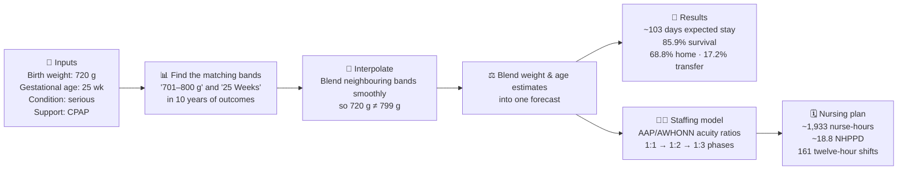
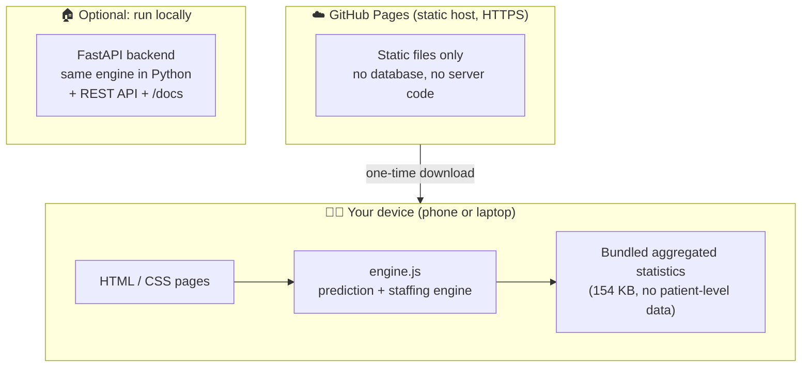

# 🩵 NeoStay — Infant NICU Outcome & Staffing Intelligence

**Live demo → https://abdulrazakucc.github.io/patient-nurse-schedule/**
*(works on any phone, tablet or laptop — nothing to install)*

NeoStay is a web application that helps care teams answer three questions the
moment a very small baby is admitted to a Neonatal Intensive Care Unit (NICU):

1. **How long will this baby likely stay in hospital?**
2. **What are the chances the baby goes home healthy?**
3. **How many nurses will the baby — and the whole unit — need?**

It is built on a decade (2016–2026) of real, aggregated outcome statistics for
**Very Low Birth Weight (VLBW)** infants — babies born under about 1,500 grams.

> ⚠️ **Important:** NeoStay is a decision-support prototype for education and
> research discussion. It is **not** a medical device and must never replace
> clinical judgment.

---

## 🍼 For the non-medical reader — what is this about?

| Term | Plain-language meaning |
|------|------------------------|
| **NICU** | The hospital ward that cares for newborn babies who need intensive care |
| **VLBW** | *Very Low Birth Weight* — a baby born weighing less than ~1,500 g (3.3 lb) |
| **Gestational age (GA)** | How many weeks the pregnancy lasted before birth (full term ≈ 40 weeks) |
| **Length of stay (LOS)** | How many days the baby stays in hospital |
| **Disposition** | How the hospital stay ends: discharged **home**, **transferred** to another hospital, or **died** |
| **IQR** | The "realistic range" — the middle 50% of similar babies fall inside it |
| **Acuity** | How sick a patient is, and therefore how much nursing attention they need |
| **NHPPD** | *Nursing Hours Per Patient Day* — a standard measure of nursing workload |
| **Census** | The list of babies currently admitted to the unit |

The core idea is simple: **the smaller and more premature a baby is, the longer
the stay and the more nursing care is needed.** NeoStay quantifies exactly that,
from real historical outcomes.

---

## 🖥️ The five pages

| Page | What you do there | Who it helps |
|------|-------------------|--------------|
| **Home** | Overview, headline statistics, "unit at a glance" | Everyone |
| **Predict** | Enter one baby's weight, age & condition → get stay / survival / nursing forecast | Neonatologists, counsellors, families |
| **Scheduling** | Build the unit's current census → get nurses needed per shift | Charge nurses, managers |
| **Timeline** | Watch care intensity change hour-by-hour across a simulated year | Educators, planners |
| **Analytics** | Interactive population charts across all weight bands & weeks | Researchers, QI teams |

---

## 🔮 How a prediction is made (visual)



Every number is **traceable to the underlying dataset**, and each forecast
displays how many similar infants stand behind it (the confidence signal):
≥50 babies → *high*, 20–49 → *moderate*, 5–19 → *low*.

### The three phases of a NICU stay

```mermaid
gantt
    dateFormat X
    axisFormat %s
    section A typical VLBW stay
    Intensive — one nurse per baby         :crit, 0, 40
    Intermediate — one nurse per 2 babies  :active, 40, 75
    Convalescent — one nurse per 3 babies  :done, 75, 103
```



Sicker or smaller babies spend proportionally longer in the intensive phase —
that is what drives the nurse-staffing forecast.

---

## 🏗️ Architecture — private by design

The entire prediction engine runs **inside your web browser**. When you use the
live site, nothing you type is ever sent to any server — the page is pure static
files, and the maths happens on your own device.



Two interchangeable engines, verified equal:

- **`frontend/engine.js`** — runs in the browser (powers the live site)
- **`backend/app/predictor.py` + `nursing.py`** — Python/FastAPI (for local use
  and API consumers)

A parity test sweeps **1,311 input combinations (14,421 values)** across both
engines and requires exact agreement — including Python's banker's rounding.

---

## 📂 Project structure

```
patient-nurse-schedule/
├── frontend/                  ← the whole web app (deployable as-is)
│   ├── index.html · predict.html · schedule.html · timeline.html
│   │   analytics.html · about.html
│   ├── engine.js              ← browser-side prediction & staffing engine
│   ├── components.js          ← shared nav / footer / icons / toasts
│   ├── styles.css             ← design system
│   ├── data/                  ← pre-built aggregated data bundles (JS)
│   └── vendor/chart.umd.min.js
├── backend/                   ← optional FastAPI service (local use)
│   └── app/ (main.py, predictor.py, nursing.py, data_loader.py, timeseries.py)
├── losdata/                   ← source aggregated CSVs (N / median / Q1 / Q3)
├── generated_data/            ← simulated year of hourly unit activity
├── datagen/generate.py        ← regenerates the simulated data
├── scripts/build_frontend_data.py  ← rebuilds frontend/data/ from the CSVs
└── .github/workflows/deploy.yml    ← auto-deploys to GitHub Pages
```

---

## 🚀 Run it

### Easiest — use the hosted app
Open **https://abdulrazakucc.github.io/patient-nurse-schedule/** on any device.

### Locally, no dependencies
```bash
cd frontend
python3 -m http.server 8000
# open http://127.0.0.1:8000
```

### Locally, with the FastAPI backend + interactive API docs
```bash
./run.sh
# open http://127.0.0.1:8000        (app)
# open http://127.0.0.1:8000/docs   (Swagger API docs)
```

### Rebuild the data bundles after changing the CSVs
```bash
python3 scripts/build_frontend_data.py
```

---

## 🔌 API (local backend)

| Method | Endpoint | Purpose |
|--------|----------|---------|
| GET | `/api/health` | Service status |
| GET | `/api/meta` | Centers + weight/GA bins |
| GET | `/api/analytics` | Aggregated distributions for charts |
| POST | `/api/predict` | Per-infant forecast `{weight_g, ga_weeks, condition, resp_support}` |
| POST | `/api/schedule` | Unit staffing from a census `{infants:[...], shifts_per_day}` |
| GET | `/api/ts/*` | Hourly timeline aggregations |

---

## 🔒 Privacy & security

- **No patient-level data anywhere.** The repository and the website contain only
  aggregated statistics (counts, medians, quartiles).
- **No data leaves your device.** The live site is static; every calculation runs
  in the browser. There is no backend, database, cookie, tracker or analytics.
- **Strict Content-Security-Policy** on every page; the only external requests
  are the two Google Fonts stylesheets. Chart.js is bundled locally.
- Served over **HTTPS** by GitHub Pages.

## ☁️ Deployment

Every push to `main` triggers `.github/workflows/deploy.yml`, which publishes
`frontend/` to **GitHub Pages** — a free, open-source-friendly static host.
Share the link with reviewers; it renders beautifully on mobile and desktop.

---

## 📖 Further reading

- **[docs/USER_GUIDE.md](docs/USER_GUIDE.md)** — a walkthrough of every page,
  written for non-technical readers, with worked examples.
- **[losdata/](losdata/)** — the source aggregated datasets with PNG/PDF charts.
- **[generated_data/README.md](generated_data/README.md)** — how the simulated
  hourly data is produced.

## 🗺️ Roadmap

- Named-nurse shift rostering (assigning people, not just counts)
- Persisting a unit census between sessions (local storage)
- Multi-center comparison once per-center data is available

## 👥 Credits

- **Waseem Altaf, MD** — project lead. Specialist in *Pediatric & Adolescent
  Medicine / Neonatal-Perinatal Medicine*; clinical direction and outcome data
  stewardship.
- **Abdul Razak, PhD** — prepared the application.

## License

Copyright © 2026 **Waseem Altaf, MD**. All rights reserved.
Licensed under the Apache License 2.0 — see [LICENSE](LICENSE).
