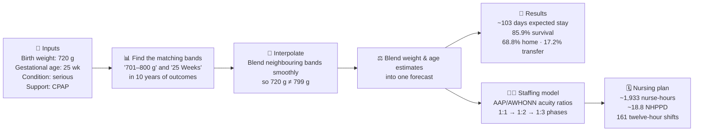
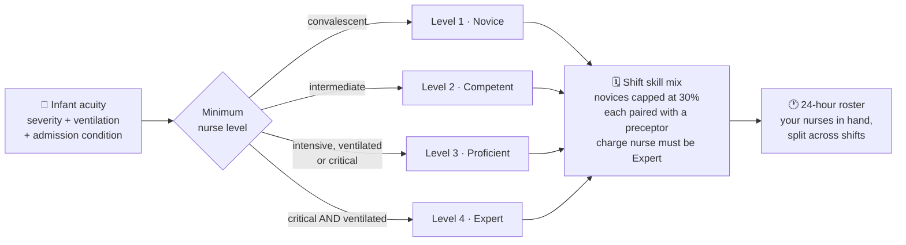
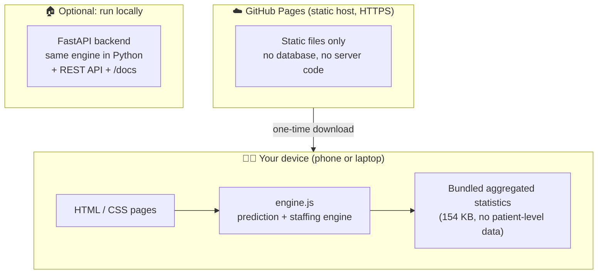

# 🩵 NeoStay — Infant NICU Outcome & Staffing Intelligence

**Live demo → https://abdulrazakucc.github.io/patient-nurse-schedule/**
*(works on any phone, tablet or laptop — nothing to install)*

NeoStay is a web application that helps care teams answer three questions the
moment a very small baby is admitted to a Neonatal Intensive Care Unit (NICU):

1. **How long will this baby likely stay in hospital?**
2. **What are the chances the baby goes home healthy?**
3. **How many nurses will the baby — and the whole unit — need?**

It is built on a decade (2016–2026) of real, aggregated outcome statistics for
**Very Low Birth Weight (VLBW)** infants — babies born under about 1,500 grams.

> ⚠️ **Important:** NeoStay is a decision-support prototype for education and
> research discussion. It is **not** a medical device and must never replace
> clinical judgment.

---

## 🍼 For the non-medical reader — what is this about?

| Term | Plain-language meaning |
|------|------------------------|
| **NICU** | The hospital ward that cares for newborn babies who need intensive care |
| **VLBW** | *Very Low Birth Weight* — a baby born weighing less than ~1,500 g (3.3 lb) |
| **Gestational age (GA)** | How many weeks the pregnancy lasted before birth (full term ≈ 40 weeks) |
| **Length of stay (LOS)** | How many days the baby stays in hospital |
| **Disposition** | How the hospital stay ends: discharged **home**, **transferred** to another hospital, or **died** |
| **IQR** | The "realistic range" — the middle 50% of similar babies fall inside it |
| **Acuity** | How sick a patient is, and therefore how much nursing attention they need |
| **NHPPD** | *Nursing Hours Per Patient Day* — a standard measure of nursing workload |
| **Census** | The list of babies currently admitted to the unit |

The core idea is simple: **the smaller and more premature a baby is, the longer
the stay and the more nursing care is needed.** NeoStay quantifies exactly that,
from real historical outcomes.

---

## 🖥️ The five pages

| Page | What you do there | Who it helps |
|------|-------------------|--------------|
| **Home** | Overview, headline statistics, "unit at a glance" | Everyone |
| **Predict** | Enter one baby's weight, age & condition → get stay / survival / nursing forecast | Neonatologists, counsellors, families |
| **Scheduling** | Build the unit's current census → get nurses needed per shift | Charge nurses, managers |
| **Timeline** | Watch care intensity change hour-by-hour across a simulated year | Educators, planners |
| **Analytics** | Interactive population charts across all weight bands & weeks | Researchers, QI teams |

---

## 🔮 How a prediction is made (visual)



Every number is **traceable to the underlying dataset**, and each forecast
displays how many similar infants stand behind it (the confidence signal):
≥50 babies → *high*, 20–49 → *moderate*, 5–19 → *low*.

## 👩‍⚕️ Nurse experience & competency

Staffing is not just *how many* nurses, but *who*. NeoStay grades nurses using
**Benner's novice-to-expert stages** (1984) — the framework behind most NICU
clinical-ladder programmes.

| Level | Stage | Experience | Typical assignment |
|:---:|---|---|---|
| **1** | Novice / Advanced Beginner | 0–1 year | Convalescent feeder-growers; intermediate care with a preceptor |
| **2** | Competent | 1–3 years | Intermediate / special care; stable intensive with support |
| **3** | Proficient | 3–5 years | Intensive 1:1, including ventilated infants; precepts novices |
| **4** | Expert | 5+ years | Most unstable infants; **charge nurse**; precepting |



Level 4 is deliberately scarce — reserved for infants who are *both* critically
ill and ventilated. Proficient nurses routinely care for ventilated VLBW
infants, and a unit cannot roster an expert to a third of its cots; making every
sick infant expert-only would produce a requirement no real unit could meet.
About 19% of the simulated cohort needs an Expert, against an expert workforce
share of 26%.

## 🕐 Rostering the nurses you actually have

The Scheduling page takes the nurses **in hand** — a count per competency level
that you edit directly — and rosters them against the census:

- each nurse works **one shift per day**, so the pool is split across shifts;
- a nurse carries at most **one full assignment** (one intensive infant, or two
  intermediate, or three convalescent);
- the sickest infants are placed first, into the **least senior qualified**
  nurse, keeping experts free for the infants who need them;
- one senior nurse is held back as **charge**, with no bedside load.

The result is a **24-hour roster chart**: one bar per nurse across a day that
starts at 07:00, split into hours committed to infants and spare capacity, and
coloured by competency level. Any infant no qualified nurse can take appears as
a red bar and is highlighted in the census table, with a banner naming exactly
how many extra nurses of which level would close the gap.

A nurse may always cover an assignment **below** their level, never above it, so
a shift's requirements accumulate downward from the expert tier. NeoStay also
reports an **effective care capacity** (experience-weighted), so a roster that
is numerically adequate but too junior shows up as a risk rather than passing
silently.

The Scheduling page plots this as three bars — *acuity demand*, *recommended
roster*, and *effective capacity* — each broken down by level. When the third
bar falls short of the first, the shift is staffed by headcount but not by
experience, and the app says so in plain language. The Predict page shows the
same idea per infant, as a competency band running along the top of the staffing
chart (Expert early in the stay, Novice by discharge).

> **Provenance.** The stages and year bands are the published Benner framework.
> The experience weightings, the 30% novice cap and the preceptor rule are
> transparent **modelling assumptions** for planning discussion — no validated
> nurse-scheduling dataset underlies them, and they are easy to change once real
> rostering data exists.

### The three phases of a NICU stay

```mermaid
gantt
    dateFormat X
    axisFormat %s
    section A typical VLBW stay
    Intensive — one nurse per baby         :crit, 0, 40
    Intermediate — one nurse per 2 babies  :active, 40, 75
    Convalescent — one nurse per 3 babies  :done, 75, 103
```



Sicker or smaller babies spend proportionally longer in the intensive phase —
that is what drives the nurse-staffing forecast.

---

## 🏗️ Architecture — private by design

The entire prediction engine runs **inside your web browser**. When you use the
live site, nothing you type is ever sent to any server — the page is pure static
files, and the maths happens on your own device.



Two interchangeable engines, verified equal:

- **`frontend/engine.js`** — runs in the browser (powers the live site)
- **`backend/app/predictor.py` + `nursing.py`** — Python/FastAPI (for local use
  and API consumers)

A parity test sweeps **1,311 input combinations (14,421 values)** across both
engines and requires exact agreement — including Python's banker's rounding.

---

## 📂 Project structure

```
patient-nurse-schedule/
├── frontend/                  ← the whole web app (deployable as-is)
│   ├── index.html · predict.html · schedule.html · timeline.html
│   │   analytics.html · about.html
│   ├── engine.js              ← browser-side prediction & staffing engine
│   ├── components.js          ← shared nav / footer / icons / toasts
│   ├── styles.css             ← design system
│   ├── data/                  ← pre-built aggregated data bundles (JS)
│   └── vendor/chart.umd.min.js
├── backend/                   ← optional FastAPI service (local use)
│   └── app/ (main.py, predictor.py, nursing.py, data_loader.py, timeseries.py)
├── losdata/                   ← source aggregated CSVs (N / median / Q1 / Q3)
├── generated_data/            ← simulated year of hourly unit activity
├── datagen/generate.py        ← regenerates the simulated data
├── scripts/build_frontend_data.py  ← rebuilds frontend/data/ from the CSVs
└── .github/workflows/deploy.yml    ← auto-deploys to GitHub Pages
```

---

## 🚀 Run it

### Easiest — use the hosted app
Open **https://abdulrazakucc.github.io/patient-nurse-schedule/** on any device.

### Locally, no dependencies
```bash
cd frontend
python3 -m http.server 8000
# open http://127.0.0.1:8000
```

### Locally, with the FastAPI backend + interactive API docs
```bash
./run.sh
# open http://127.0.0.1:8000        (app)
# open http://127.0.0.1:8000/docs   (Swagger API docs)
```

### Rebuild the data bundles after changing the CSVs
```bash
python3 scripts/build_frontend_data.py
```

---

## 🔌 API (local backend)

| Method | Endpoint | Purpose |
|--------|----------|---------|
| GET | `/api/health` | Service status |
| GET | `/api/meta` | Centers + weight/GA bins |
| GET | `/api/analytics` | Aggregated distributions for charts |
| POST | `/api/predict` | Per-infant forecast `{weight_g, ga_weeks, condition, resp_support}` |
| POST | `/api/schedule` | Unit staffing from a census `{infants:[...], shifts_per_day}` |
| GET | `/api/ts/*` | Hourly timeline aggregations |

---

## 🔒 Privacy & security

- **No patient-level data anywhere.** The repository and the website contain only
  aggregated statistics (counts, medians, quartiles).
- **No data leaves your device.** The live site is static; every calculation runs
  in the browser. There is no backend, database, cookie, tracker or analytics.
- **Strict Content-Security-Policy** on every page; the only external requests
  are the two Google Fonts stylesheets. Chart.js is bundled locally.
- Served over **HTTPS** by GitHub Pages.

## ☁️ Deployment

Every push to `main` triggers `.github/workflows/deploy.yml`, which publishes
`frontend/` to **GitHub Pages** — a free, open-source-friendly static host.
Share the link with reviewers; it renders beautifully on mobile and desktop.

---

## 📖 Further reading

- **[docs/USER_GUIDE.md](docs/USER_GUIDE.md)** — a walkthrough of every page,
  written for non-technical readers, with worked examples.
- **[losdata/](losdata/)** — the source aggregated datasets with PNG/PDF charts.
- **[generated_data/README.md](generated_data/README.md)** — how the simulated
  hourly data is produced.

## 🗺️ Roadmap

- Named-nurse shift rostering (assigning people, not just counts)
- Persisting a unit census between sessions (local storage)
- Multi-center comparison once per-center data is available

## 👥 Credits

- **Waseem Altaf, MD** — project lead. *Neonatologist*; clinical direction and
  outcome data stewardship.
- **Abdul Razak, PhD** — prepared the application.

## License

Copyright © 2026 **Waseem Altaf, MD**. All rights reserved.
Licensed under the Apache License 2.0 — see [LICENSE](LICENSE).
