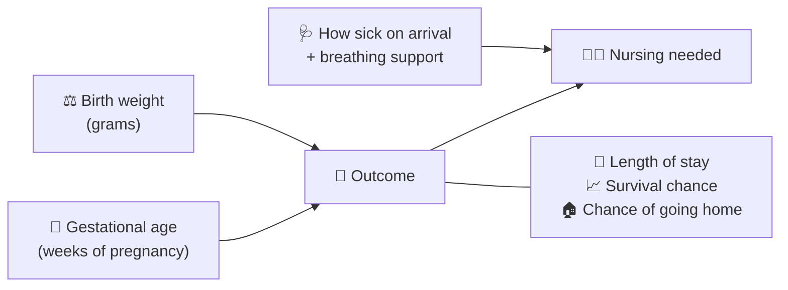
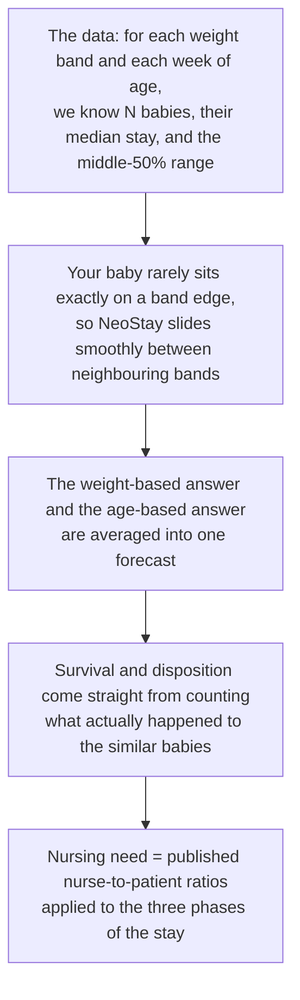

# NeoStay User Guide

*A plain-language walkthrough for clinicians, students and curious readers.*

**Open the app:** https://abdulrazakucc.github.io/patient-nurse-schedule/
It works in any modern browser, on a phone or a laptop. Nothing is installed,
and nothing you type is sent anywhere — all calculations happen on your device.

---

## 1. The story in one picture

Very small babies (born under ~1,500 g) need weeks or months of hospital care.
How much care depends mostly on **two numbers known at birth**:

NeoStay looks up ten years of real outcomes for babies with the *same* weight
and age, and shows you what happened to them.

---

## 2. Page-by-page walkthrough

### 🏠 Home
The landing page. Headline numbers (how many infants are behind the data,
typical stay, overall survival) and a live mini-chart. Use the cards or the
top navigation to reach the tools.

### 🔮 Predict — *"What should we expect for this baby?"*

**Try this worked example:**

1. Set **Birth weight** to `720 g` (use the slider or type it).
2. Set **Gestational age** to `25 weeks`.
3. Choose condition `Serious` and support `CPAP`.
4. Press **Generate forecast**.

You will see:

| Result | Example value | How to read it |
|--------|---------------|----------------|
| Expected length of stay | ~103 days | Half of similar babies stayed between ~85 and ~125 days |
| Survival probability | ~86% | Based on 64 similar infants (high confidence) |
| Disposition rings | 69% home · 17% transfer · 14% died | How similar admissions ended |
| Nurse staffing | ~18.8 NHPPD, ~1,933 nurse-hours | The nursing effort this one baby will need over the whole stay |

The **confidence badge** tells you how many real babies stand behind the
numbers — more babies, more trust.

You also get **two charts**:

- **Expected length of stay in context** — the shaded band is the middle 50% of
  all infants at each birth weight; the red dot is *your* infant. It answers
  "is this baby typical, or an outlier?" at a glance.
- **Nurse staffing forecast across the stay** — a day-by-day line showing the
  nursing requirement stepping down from 1 nurse per baby, through 1:2, to 1:3
  as the infant recovers.

How to read that second chart:

| What you see | What it means |
|---|---|
| Y axis `1 : 1`, `1 : 2`, `1 : 3` | How many babies one nurse covers. `1:1` = a nurse devoted to this baby alone |
| Coloured band along the **top** | The minimum nurse level each phase needs — `L4 Expert` early, `L1 Novice` by discharge |
| Dashed vertical markers | The day care steps down to a lower ratio, e.g. *"day 57 → 1 : 2"* |
| Pink shaded area | The **likely discharge window** — the stay is a forecast, not a fixed date |
| Red line | Expected (median) discharge day |
| Dashed tail | Care simply continues at 1:3 if the stay runs longer than expected |

And a **nurse competency requirement** panel naming the minimum level of nurse
for this infant at admission, and for each phase of the stay.

### 🗓️ Scheduling — *"How many nurses does the unit need tonight?"*

1. Press **Load sample unit (8 infants)** to see it work instantly, or add
   babies one at a time with the form.
2. Each baby is classified by acuity:
   - 🔴 **Intensive** — one nurse cares for one baby (1:1)
   - 🟡 **Intermediate** — one nurse for two babies (1:2)
   - 🟢 **Convalescent** — one nurse for three babies (1:3)
3. The cards at the top show **nurses needed per shift** (bedside + one charge
   nurse) and total daily nurse-shifts.

Remove any row with ✕ and the numbers update immediately.

**The skill-mix panel** then answers the harder question — *which* nurses:

| Level | Stage | Experience |
|:---:|---|---|
| 1 | Novice / Advanced Beginner | 0–1 year |
| 2 | Competent | 1–3 years |
| 3 | Proficient | 3–5 years |
| 4 | Expert | 5+ years |

Every infant row shows the **minimum nurse level** it requires, and the panel
recommends how many nurses of each level the shift needs. Three safety rules are
applied and will raise a warning if broken:

1. The **charge nurse must be an Expert** (level 4).
2. **Novices are capped at 30%** of the bedside team.
3. **Every novice is paired** with a proficient or expert preceptor.

The **effective care capacity** figure is experience-weighted, so a shift with
the right headcount but too many junior nurses is visible as a risk instead of
looking adequate.

**The coverage chart** makes that concrete. Three bars, all measured in nurses
and broken down by level:

1. **Acuity demand** — what the babies need, at the level each one requires
2. **Recommended roster** — whole nurses, after the novice cap is applied
3. **Effective capacity** — what that roster actually delivers once experience
   is weighted

If bar 3 is shorter than bar 1, the shift is staffed *by the numbers* but too
junior to carry the work, and a plain-language verdict says so. Try adding nine
stable 1650 g feeder-growers: three nurses covers the count on paper, but an
all-Competent team delivers only 2.7 against 3.0 of demand.

### Nurses available, and the 24-hour roster

At the top of the results you set **how many nurses you actually have**, level by
level, with the + and − buttons. Everything below recalculates instantly —
whether you change the staffing or add and remove infants.

The **24-hour roster** then shows one bar per nurse across a day that starts at
07:00:

| What you see | What it means |
|---|---|
| Solid coloured bar | Hours **committed to infants**, coloured by the nurse's level |
| Pale bar | On duty with **spare capacity** — room to take an admission |
| Red bar | An infant **nobody qualified is free to take** |
| Shaded half / divider | The shift boundary (day and night, or three shifts) |

Hover any bar to see which infants that nurse holds and what percentage of the
whole day they are committed for. A nurse on a fully loaded 12-hour shift is
committed for 50% of the day; the charge nurse shows as all-pale because they
carry no bedside assignment by design.

**When demand exceeds your staff**, the banner at the top turns red and states
how many infants cannot be covered on the worst-affected shift, together with
the exact reinforcement needed — for example *"+2 × L3 Proficient"*. Those cots
turn red in the census table too. Press **Auto-fill to meet demand** and the app
raises staffing until every infant is covered.

### ⏱️ Timeline — *"How does care change hour by hour?"*

Follows a simulated (but statistically realistic) year of unit activity:

- **Single infant journey** — pick a baby and watch nursing need fall as it
  moves from intensive → intermediate → convalescent care.
- **Busiest week** — nurses on duty vs. demand vs. babies present, hourly.
- **Around the clock** — average demand by hour of day (spoiler: it never stops).

### 📊 Analytics — *"What does a decade of outcomes look like?"*

Three interactive charts. The consistent message:

> Every extra 100 g of weight and every extra week of pregnancy shortens the
> stay and improves the odds of going home.

Hover or tap any bar for exact numbers.

### ℹ️ About
The methodology in six cards, plus the "anatomy of a forecast" — read this
before quoting numbers in a discussion.

---

## 3. How the maths works (no formulas, promise)

Two important honesty rules:

1. **Nothing is invented.** If only 4 similar babies exist, NeoStay says so
   ("very low confidence") rather than pretending to know.
2. **Averages are not destinies.** A forecast describes *groups* of similar
   babies; any individual baby can do better or worse.

---

## 4. Frequently asked questions

**Is my input stored or transmitted?**
No. The site is static files; the calculation runs in your browser's memory and
vanishes when you close the tab.

**Can I use this for real clinical decisions?**
No — it is a decision-support prototype for education and research discussion.
It has not been validated as a medical device.

**Why do tiny babies sometimes show *shorter* stays?**
Sadly, because in the smallest weight bands more babies die early in the
admission. The disposition rings make this visible rather than hiding it.

**Where does the data come from?**
Aggregated center outcome tables for 2016–2026 (counts, medians, quartiles per
weight band and per gestational week) in [`losdata/`](../losdata/). No
patient-level records exist anywhere in this project.

**It says "moderate confidence" — should I trust it?**
The badge maps directly to sample size: high ≥ 50 similar babies,
moderate 20–49, low 5–19. Treat low-confidence numbers as rough sketches.

---

## 5. Sharing with colleagues

Send the link — that's it:

> **https://abdulrazakucc.github.io/patient-nurse-schedule/**

On a phone, the menu is behind the ☰ button, and every chart responds to touch.
Feedback is welcome via GitHub issues on the repository.
